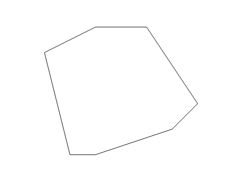

# Vaion-Test

    The goal of this exercise was to take a polygon defined by the points 'points', use the mouse
    events to draw a line that will split the polygon and then draw the two split polygons.
    1. Starting with initial polygon 
    2. While dragging the mouse, the polygon should be shown along with the line you're drawing (mouseMove.png)
    3. After letting go of the mouse, the polygon will be split into two along that line (mouseUp.png)

    The code provided here tests my coding abilities in Javascript, namely Object and Array creation, looping, 
    SVG element drawing and an ability to identify, understand and utilise mathematical equations in the 
    field of geometry. 

